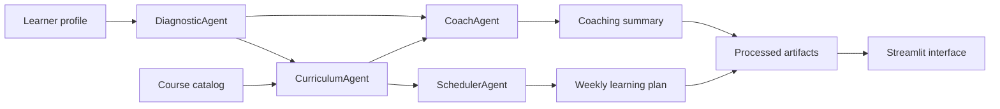

# Learning Path Agents

## PT-BR

Sistema multiagente em Python para geração de trilhas de estudo personalizadas com foco em transição de carreira e upskilling técnico.

O projeto foi desenhado para simular um fluxo de produto em que diferentes agentes especializados colaboram para transformar um perfil profissional em uma trilha prática de aprendizado. Em vez de um único bloco de recomendação, a solução separa o raciocínio em diagnóstico, curadoria, planejamento e coaching, o que torna o comportamento mais interpretável e mais fácil de evoluir.

### Problema que o projeto resolve

Profissionais que querem migrar de área ou aprofundar competências técnicas normalmente enfrentam três dificuldades:

- não sabem exatamente quais lacunas de conhecimento precisam fechar
- escolhem cursos sem ordem ou critério claro
- não conseguem converter intenção de estudo em um plano semanal executável

Este projeto aborda essas três dores com uma arquitetura multiagente leve, reproduzível e orientada a decisão.

### Arquitetura



### Agentes

#### `DiagnosticAgent`

Responsável por interpretar o perfil do usuário.

Entradas:
- objetivo profissional
- papel-alvo
- nível atual
- horas por semana
- habilidades conhecidas

Saídas:
- resumo do objetivo
- intensidade sugerida (`light`, `balanced`, `accelerated`)
- lista de `skill_gaps`

Lógica:
- normaliza as habilidades já conhecidas
- consulta um conjunto de competências-alvo por papel
- compara o que o usuário já possui com o skill pool do catálogo
- retorna apenas lacunas que também existem no catálogo, para manter a recomendação acionável

#### `CurriculumAgent`

Responsável pela recomendação dos cursos.

Entradas:
- diagnóstico gerado pelo agente anterior
- catálogo de cursos

Saídas:
- ranking dos cursos mais aderentes
- subconjunto final com `top_k = 6`

Lógica:
- constrói uma consulta textual com:
  - objetivo
  - papel-alvo
  - skill gaps
- concatena `title + description + skills` de cada curso
- aplica `TF-IDF` com `ngram_range=(1, 2)` e `stop_words="english"`
- calcula similaridade por cosseno entre consulta e catálogo
- aplica uma penalização por diferença de nível (`level_penalty`)
- calcula `final_score = match_score - 0.05 * level_penalty`

Isso ajuda a evitar que um curso semanticamente relevante, mas muito acima ou muito abaixo do nível do usuário, domine o ranking sem controle.

#### `SchedulerAgent`

Responsável por transformar recomendações em um plano semanal.

Entradas:
- perfil do usuário
- cursos selecionados

Saídas:
- plano de `6` semanas
- distribuição de horas por semana
- lista de atividades por semana

Lógica:
- usa `weekly_hours` como capacidade semanal
- consome os cursos em ordem de prioridade
- aloca horas até esgotar a capacidade da semana
- preserva o saldo restante do curso para a semana seguinte

Esse comportamento é equivalente a uma fila de trabalho com capacidade fixa por sprint semanal.

#### `CoachAgent`

Responsável pela camada interpretativa.

Entradas:
- diagnóstico
- cursos selecionados
- plano semanal

Saídas:
- narrativa estratégica da trilha
- riscos de pacing
- sinais de sucesso

Lógica:
- detecta riscos simples com base em:
  - horas semanais baixas
  - presença de cursos avançados para usuários iniciantes
  - gaps importantes ligados a prática aplicada, como `llm` ou `rag`
- resume a trilha priorizando as `tracks` mais frequentes

### Dados

O projeto usa dados sintéticos controlados, com foco em reproduzibilidade e clareza do raciocínio.

#### Catálogo de cursos

Arquivo:
- `data/raw/course_catalog.csv`

Contém:
- `18` cursos
- `7` trilhas principais:
  - `data`
  - `analytics`
  - `data engineering`
  - `machine learning`
  - `llm`
  - `cloud`
  - `communication`

Colunas:
- `course_id`
- `title`
- `track`
- `level`
- `duration_hours`
- `skills`
- `description`

#### Perfil demo

Arquivo:
- `data/raw/sample_profile.json`

Representa uma profissional com background em analytics e objetivo de migrar para `Applied AI Engineer`.

### Pipeline

O pipeline principal está em:
- `src/pipeline.py`

Fluxo:
1. gera ou atualiza os dados demo
2. executa o `DiagnosticAgent`
3. executa o `CurriculumAgent`
4. executa o `SchedulerAgent`
5. executa o `CoachAgent`
6. persiste artefatos processados para consumo da interface

Artefatos gerados:
- `data/processed/learning_plan.json`
- `data/processed/selected_courses.csv`
- `data/processed/summary.json`

### Técnicas usadas

#### 1. Heuristic gap analysis

O diagnóstico inicial é feito por regras simples, transparentes e controláveis.

Vantagem:
- interpretabilidade
- baixo custo computacional
- facilidade de ajuste por papel-alvo

#### 2. Text retrieval para recomendação

O motor de curadoria usa recuperação semântica leve com `TF-IDF + cosine similarity`, o que é suficiente para um catálogo pequeno e estruturado.

Vantagem:
- rápido
- determinístico
- fácil de explicar
- muito bom para baseline de recomendação textual

#### 3. Constraint-aware ranking

A recomendação não usa só similaridade textual bruta; ela ajusta o score com uma penalização por diferença entre o nível do curso e o nível do usuário.

Isso reduz desalinhamento pedagógico.

#### 4. Capacity-based scheduling

O plano semanal é montado como um problema simples de alocação de carga horária com capacidade fixa por semana.

Isso deixa a trilha mais próxima de um plano operacional real, em vez de apenas listar cursos.

#### 5. Coaching layer

A camada de coaching funciona como um agente explicador, útil para dar:
- justificativa da trilha
- riscos de execução
- checkpoints de acompanhamento

### Bibliotecas e frameworks

#### `pandas`

Usado para:
- modelagem tabular do catálogo
- seleção dos cursos
- persistência dos artefatos

#### `scikit-learn`

Usado para:
- `TfidfVectorizer`
- `cosine_similarity`

Papel no projeto:
- transformar catálogo e objetivo do usuário em vetores
- calcular aderência semântica entre perfil e cursos

#### `Streamlit`

Usado para:
- captura do perfil do usuário
- visualização da trilha
- inspeção das recomendações e do coaching

#### `Plotly`

Usado para:
- gráfico de alocação semanal de horas

### O que este projeto é e o que ele não é

Este projeto é:
- um sistema multiagente de recomendação e planejamento
- uma prova de conceito de decomposição de tarefas em agentes especializados
- uma arquitetura local, reprodutível e explicável

Este projeto não é:
- fine-tuning de LLM
- recomendação baseada em histórico de múltiplos usuários
- sistema de reinforcement learning
- API conectada a LMS real

Ou seja, aqui a ênfase está em `agent design`, `retrieval`, `ranking` e `planning`, e não em treinamento de modelo generativo.

### Resultados atuais da demo

Execução atual:
- `18` cursos no catálogo
- `6` cursos selecionados
- `6` semanas planejadas
- `48` horas totais de estudo
- papel-alvo: `Applied AI Engineer`
- curso mais recomendado: `Prompt Engineering and Evaluation`

Skill gaps identificados na demo:
- `rag`
- `mlops`
- `api`
- `evaluation`
- `embeddings`

### Estrutura do repositório

- `app.py`
- `main.py`
- `src/agents.py`
- `src/pipeline.py`
- `src/data_generation.py`
- `tests/test_pipeline.py`

### Como executar

```bash
python3 -m venv .venv
source .venv/bin/activate
pip install -r requirements.txt
python3 main.py
streamlit run app.py
```

### Teste automatizado

O teste em `tests/test_pipeline.py` valida:

- geração dos artefatos
- quantidade esperada de cursos selecionados
- existência de um plano de `6` semanas

### Próximos passos possíveis

- adicionar embeddings para recomendação semântica mais rica
- conectar um LLM como agente de coaching textual
- adicionar feedback do usuário para reordenar a trilha
- transformar o pipeline em API de serving
- incluir trilhas adaptativas com revisão semanal

---

## EN

Python multi-agent system for personalized learning path generation focused on professional upskilling and career transition.

### What it does

The project decomposes learning-path generation into four specialized agents:

- `DiagnosticAgent`
- `CurriculumAgent`
- `SchedulerAgent`
- `CoachAgent`

Together, they transform a learner profile into:
- a gap analysis
- a ranked list of recommended courses
- a weekly study plan
- a coaching summary with pacing risks

### Technical design

The recommendation layer uses:
- `TF-IDF`
- `cosine similarity`
- level-aware score adjustment

The planning layer uses:
- weekly capacity allocation
- ordered course consumption across six weeks

### Technical stack

- `pandas`
- `scikit-learn`
- `Streamlit`
- `Plotly`

### Current demo output

- `18` catalog courses
- `6` recommended courses
- `6` planned weeks
- `48` total study hours
- top recommendation: `Prompt Engineering and Evaluation`

### Notes

This repository focuses on agent decomposition, retrieval, ranking, and planning. It does not fine-tune an LLM; instead, it provides a reproducible multi-agent baseline that can later be extended with embeddings, LLM coaching, and feedback loops.
