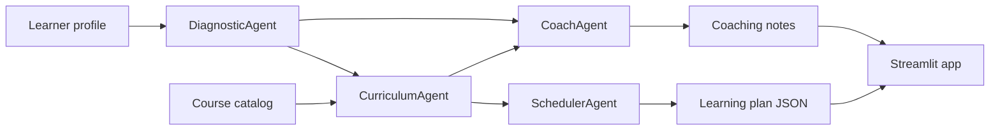

# Learning Path Agents

## PT-BR

Projeto em Python para gerar trilhas de estudo personalizadas com uma arquitetura multiagente orientada a desenvolvimento de carreira.

### Objetivo

Simular um sistema em que diferentes agentes colaboram para:

- diagnosticar lacunas de conhecimento
- selecionar cursos mais aderentes ao objetivo profissional
- distribuir a carga semanal de estudo
- oferecer coaching e alertas de pacing

### Agentes

- `DiagnosticAgent`
  Analisa o objetivo do usuário, o papel-alvo e as habilidades já conhecidas para inferir gaps.
- `CurriculumAgent`
  Faz matching entre o objetivo do usuário e o catálogo de cursos usando similaridade textual.
- `SchedulerAgent`
  Monta um plano de estudo de `6` semanas respeitando a disponibilidade semanal.
- `CoachAgent`
  Resume a estratégia da trilha, aponta riscos e sugere sinais de sucesso.

### Arquitetura



### Dados

O projeto usa um catálogo sintético de cursos com:

- `18` cursos
- trilhas de `data`, `analytics`, `data engineering`, `machine learning`, `llm`, `cloud`, `communication`
- níveis `beginner`, `intermediate`, `advanced`

Também inclui um perfil demo para mostrar a geração de uma trilha para transição em direção a `Applied AI Engineer`.

### Técnicas e bibliotecas

- `pandas`
  Estrutura o catálogo e os artefatos da trilha.
- `scikit-learn`
  Usa `TF-IDF` e `cosine similarity` para recomendar os cursos mais aderentes.
- `Streamlit`
  Entrega a interface interativa para o usuário configurar o perfil e visualizar a trilha.
- `Plotly`
  Mostra a distribuição semanal de horas da trilha.

### Como funciona a recomendação

1. O `DiagnosticAgent` cruza habilidades conhecidas com skills típicas do papel-alvo.
2. O `CurriculumAgent` transforma o objetivo e os gaps em uma consulta textual.
3. O catálogo é vetorizado com `TF-IDF`.
4. A similaridade por cosseno ranqueia os cursos.
5. O `SchedulerAgent` aloca os cursos ao longo das semanas com base na carga horária.
6. O `CoachAgent` gera uma leitura executiva da trilha.

### Resultados atuais da demo

- `18` cursos no catálogo
- `6` cursos selecionados
- `6` semanas planejadas
- `48` horas totais de estudo
- papel-alvo: `Applied AI Engineer`
- curso mais recomendado: `Prompt Engineering and Evaluation`

### Como executar

```bash
python3 -m venv .venv
source .venv/bin/activate
pip install -r requirements.txt
python3 main.py
streamlit run app.py
```

---

## EN

Python project for building personalized learning paths with a multi-agent architecture focused on professional upskilling.

### Goal

The system simulates a collaborative agent workflow that:

- diagnoses knowledge gaps
- recommends the most relevant courses
- builds a weekly study plan
- adds coaching guidance and pacing alerts

### Agents

- `DiagnosticAgent`
- `CurriculumAgent`
- `SchedulerAgent`
- `CoachAgent`

### Technical stack

- `pandas`
- `scikit-learn`
- `Streamlit`
- `Plotly`

### Demo output

- `18` catalog courses
- `6` recommended courses
- `6` planned weeks
- `48` total study hours
- top recommendation: `Prompt Engineering and Evaluation`
